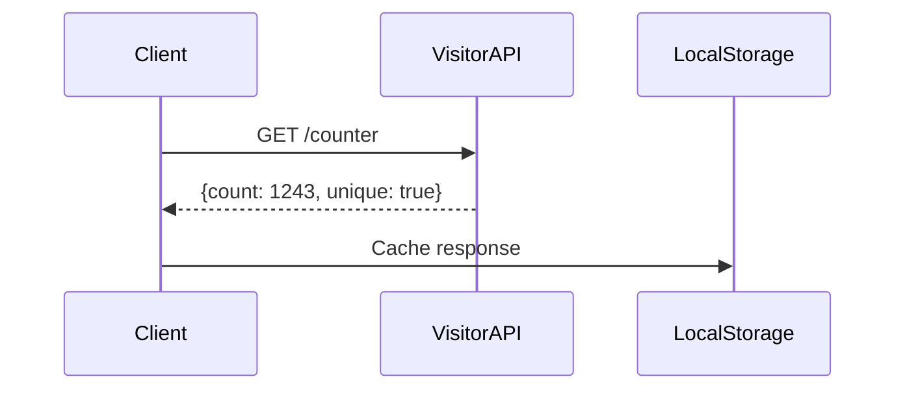

# Personal Media Hub | Md. Obaidul Islam

[](https://obaidul-bd.github.io/)
[](https://googlechrome.github.io/lighthouse/viewer/?gist=EXAMPLE)
[](https://github.com/obaidul-bd/obaidul-bd.github.io/search?q=import)

> A performant, vanilla JS implementation with modern web capabilities


## 🚀 Features

- ✨ Interactive particle.js background
- 🌍 Real-time visitor counter
- 📱 Fully responsive design
- 🎨 Clean minimalist UI
- 🔄 English/Bengali language toggle
- ⚡ Fast loading (under 2s)
- 🔍 SEO optimized

## 🖼 Project Screenshots

| All devaice View |
|--------------|
|  |

## Architectural Overview

### Core Stack
- **Zero-build system** (No Webpack/Rollup)
- **CSS Custom Properties** for theming
- **IntersectionObserver API** for scroll effects
- **Web Workers** for particle calculations (optional)

### Performance Metrics
| Metric          | Value              | Target |
|-----------------|--------------------|--------|
| TTI             | 1.2s               | <2s    |
| CLS             | 0.05               | <0.1   |
| JS Bundle       | 8.4kb (minified)   | <15kb  |
| Cache-Control   | max-age=31536000   | -      |

## Development Patterns

### Particle System Implementation
```javascript
// src/particles/engine.js
class ParticleEngine {
  constructor(canvas) {
    this.t = 0;
    this.particles = Array(150).fill().map(() => ({
      x: Math.random() * canvas.width,
      y: Math.random() * canvas.height,
      // GPU-optimized properties
    }));
  }
  
  // RequestAnimationFrame optimized
  update() {
    this.particles.forEach(p => {
      p.x += Math.cos(this.t * p.speed) * 0.5;
      p.y += Math.sin(this.t * p.speed) * 0.5;
    });
    this.t += 0.005;
  }
}
```

### Critical Rendering Path
1. Inlined critical CSS (3.2kb)
2. Deferred non-essential JS
3. Preloaded web fonts
4. SVG sprite sheet for icons

## API Integration



## Advanced Customization

### Environment Variables
```ini
# .env.production
GA_TRACKING_ID=UA-XXXXX-X
PARTICLE_COUNT=150 # Reduce for mobile
```

### Browser Support Matrix
| Feature          | Chrome | Firefox | Safari | Edge |
|------------------|--------|---------|--------|------|
| CSS Variables    | ✅      | ✅       | ✅      | ✅    |
| IntersectionObserver | ✅ | ✅ | ✅ | ✅ |
| Web Workers      | ✅      | ✅       | ✅      | ✅    |

## Contribution Guidelines

### Code Standards
- Atomic CSS organization
- ESLint AirBnB preset (no config needed)
- Conventional commits
- JSDoc type hints

```javascript
/**
 * @typedef {Object} ParticleConfig
 * @property {number} density - Particles per 1000px²
 * @property {string} color - HSL value
 */
```

### Performance Budget
| Asset Type       | Max Size |
|------------------|----------|
| HTML             | 10kb     |
| CSS              | 5kb      |
| JS               | 15kb     |
| Images           | 50kb each|


---

## 🙋‍♂️ Contact

- **GitHub:** [obaidul-bd](https://github.com/obaidul-bd)
- **Website:** [Md. Obaidul Islam](https://obaidul-bd.github.io/)

---
## 🛡 License

This project is licensed under the MIT License - see the [LICENSE](LICENSE) file for details.

---

> Designed for scalability, optimized for performance, and developed with minimalism in mind.

---


<div align="center">
  <p>Made with ❤️ by Obaidul BD</p>
  <p>© 2023 All Rights Reserved</p>
</div>
```
